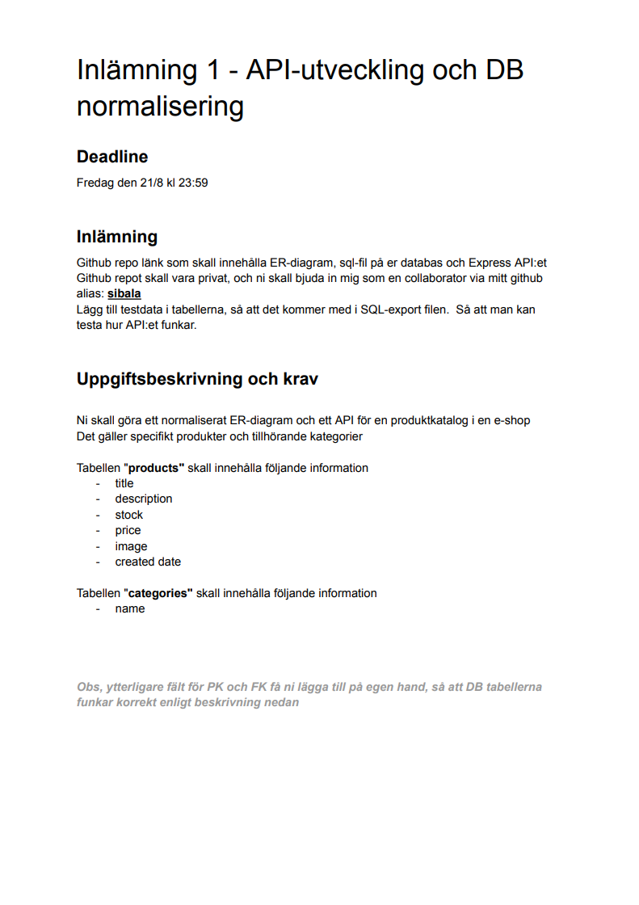
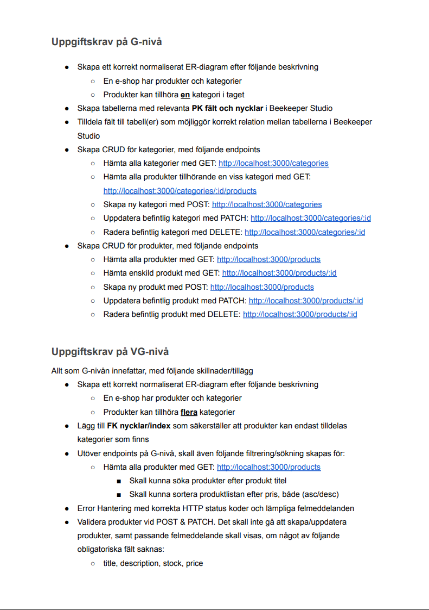
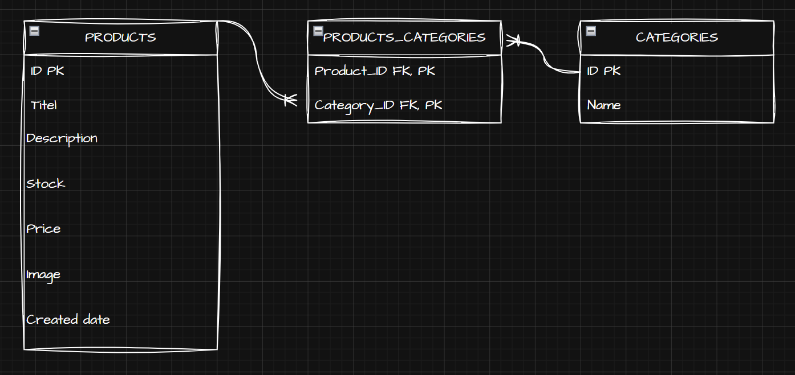
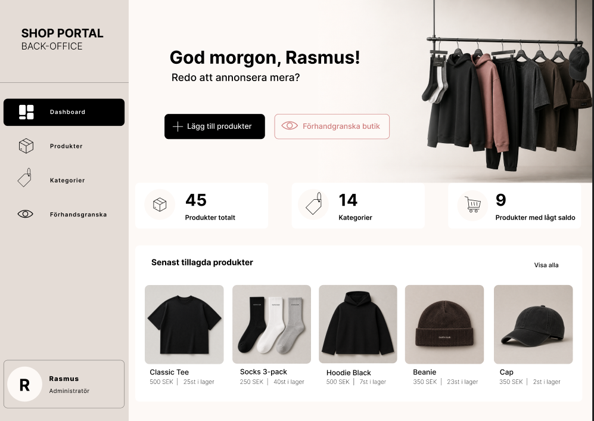
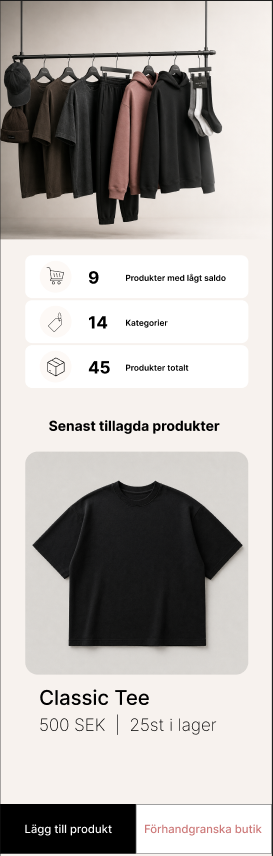

# E-Shop API

REST API för en produktkatalog till en e-shop.

Projektet är byggt med Node.js, Express och MySQL. API:t innehåller CRUD-funktionalitet för produkter och kategorier samt stöd för att koppla produkter till flera kategorier.

## Beskrivning inlämningsuppgift




## Teknik

- Node.js
- Express
- MySQL
- dotenv
- Insomnia
- Beekeeper Studio

## Databas

Databasen består av tre tabeller:

### products

Innehåller information om produkterna:

- id
- title
- description
- stock
- price
- image
- created_date

### categories

Innehåller produktkategorier:

- id
- name

### product_categories

Kopplingstabell mellan produkter och kategorier.

Tabellen innehåller:

- product_id
- category_id

Kopplingstabellen gör det möjligt för en produkt att tillhöra flera kategorier och för en kategori att innehålla flera produkter.

## ER-diagram



## Installation

1. Klona repot och öppna projektet i VS Code.

2. Gå till backend-mappen:

```bash
cd backend
```

3. Installera dependencies:

```bash
npm install
```

4. Skapa en MySQL-databas och importera SQL-filen som finns i repot. SQL-filen innehåller tabeller och testdata.

5. Skapa en `.env`-fil i `backend`-mappen och ange dina egna databasuppgifter:

```env
DB_HOST=din-databasserver
DB_PORT=din-port
DB_USER=din-användare
DB_PASSWORD=ditt-lösenord
DB_NAME=din-databas
```

6. Starta servern:

```bash
node server.js
```

Servern körs på:

```text
http://localhost:3000
```

7. API:t kan testas med Insomnia.

## Databasinstallation

Databasen kan återskapas med SQL-filerna i mappen `database`.

Kör filerna i följande ordning:

1. `categories.sql`
2. `products.sql`
3. `product_categories.sql`

Detta skapar tabellerna, relationerna och testdata som används av API:t.

# Frontend

Byggs med React, Vite och scss. Designat i Figma. För att visa upp så mycket teknik som möjligt av det som uppgiften krävde, valde jag att omsätta backend till ett "Back-office" system för en e-shop.

Produktbilder och hero är designat av mig med AI.

## Figma design


 